# Распределение задач для команды: «ФинПитомец» (FinPet)

## Состав команды и зоны ответственности

В соответствии со стеком проекта (**Kotlin, Jetpack Compose, Room, Hilt, Offline-first**) и спецификой хакатона (где внешняя серверная часть не требуется по ТЗ 3.2, а вся бизнес-логика выполняется на устройстве), роли распределяются по слоям архитектуры:

* **Backend Dev 1 (Архитектура данных, экономика и ядро):** 
  * Проектирование схемы Room DB, DataStore, Core Domain.
  * Математические калькуляторы экономики (сытость, настроение, здоровье, очки эволюции, соблюдение бюджета).
  * Use Cases для бюджета, покупок и накоплений. Unit-тесты ключевой финансовой логики.
* **Backend Dev 2 (Контент, квесты, сценарии и демо-контроллер):**
  * Спецификация и наполнение JSON-ассетов (`quests.json`, `purchases.json`, `goals.json`).
  * Репозитории загрузки и кэширования контента.
  * Логика интерактивных квестов и ветвления сценариев.
  * Контроллер Демо-режима (переключение 5 периодов, моментальный сброс профиля).
  * Логика защищённого раздела для взрослого (математический барьер, начисление бонусов).
* **Frontend Dev (UI/UX, Compose, дизайн-система и анимации):**
  * Дизайн-система Material 3 (цветовые токены, шрифты $\ge 16$ sp, кликабельные зоны $\ge 48$ dp).
  * Интеграция и анимации питомца (Lottie / Compose Animation для 3 стадий и 3 эмоций).
  * Все экраны приложения на Jetpack Compose: Онбординг, Конструктор питомца, Главный дашборд, Бюджет, Магазин (с кейсом нехватки средств), Копилка, Квесты, Экран взрослого.
  * Навигация (Navigation Compose) и связывание StateFlow из ViewModels с интерфейсом.

---

## Матрица задач по участникам

### 🟢 Backend Dev 1: Данные, экономика и финансовая логика

| ID таски | Название задачи | Описание и требования | Зависимости | Артефакт / Результат |
|---|---|---|---|---|
| **BE1-01** | Базовый каркас проекта и DI (Hilt) | Настройка Gradle (`build.gradle.kts`), зависимостей Compose, Room, Hilt, Serialization, DataStore. Application-класс, базовые модули DI. | Нет | Проект собирается в Android Studio |
| **BE1-02** | Схема БД Room и Entity | Создание таблиц: `ProfileEntity`, `PeriodEntity`, `PurchaseEntity`, `GoalEntity`, `QuestProgressEntity`. Настройка `AppDatabase`, TypeConverters. | BE1-01 | Room DB сгенерирована и компилируется |
| **BE1-03** | DAO и базовые репозитории | Написание DAO интерфейсов для профиля, периодов, покупок и целей с поддержкой Kotlin Coroutines и Flow. | BE1-02 | Работающие CRUD-методы к базе данных |
| **BE1-04** | DataStore Preferences | Реализация хранилища простых настроек: флаг онбординга, тумблеры звука/музыки, статус демо-режима. | BE1-01 | `SettingsRepository` |
| **BE1-05** | Калькулятор экономики (Domain) | Реализация чистой математики (раздел 2 ТЗ): расчет сытости, настроения, здоровья, очков эволюции ($0..4$) и процента выполнения плана ($Plan\ vs\ Fact$). Защита от деления на 0. | Нет | `PetEconomyCalculator.kt` + Unit-тесты |
| **BE1-06** | Use Cases бюджета и покупок | Бизнес-логика: `ConfirmBudgetUseCase` (проверка суммы $\le$ баланс), `MakePurchaseUseCase` (списание монет, обновление сытости/настроения, запись в историю). | BE1-03, BE1-05 | `domain/usecase/budget/*` |
| **BE1-07** | Use Cases копилки и целей | `DepositToGoalUseCase`, `WithdrawFromGoalUseCase` (валидация списания, пересчет оставшихся периодов по формуле). | BE1-03 | `domain/usecase/goals/*` |
| **BE1-08** | Unit-тестирование финансовой логики | Покрытие тестами валидатора бюджета, запрета отрицательного баланса, расчетов очков роста и соблюдения плана (требование 3.4 и 8.2). | BE1-05, BE1-06 | Зеленый прогон Unit-тестов в JUnit4/5 |

---

### 🟡 Backend Dev 2: Контент, квесты, демо-движок и модуль взрослого

| ID таски | Название задачи | Описание и требования | Зависимости | Артефакт / Результат |
|---|---|---|---|---|
| **BE2-01** | Подготовка JSON-контента | Создание в `assets/content/` валидных файлов по контрактам: 6 сюжетных квестов (`quests.json`), 8 товаров (`purchases.json`), 3 цели (`goals.json`), 27 вариантов питомца (`pet_parts.json`). | Нет | Валидные JSON-файлы с текстами и балансом |
| **BE2-02** | Content Asset Loader & Parser | Создание data-классов с `@Serializable` и загрузчика из assets. Кэширование и первоначальное наполнение Room DB при первом запуске (Database Callback/Prepopulate). | BE1-02, BE2-01 | `ContentRepository.kt` |
| **BE2-03** | Движок квестов и сценариев | Обработка выбора пользователя в квесте: начисление награды (+20..50 монет), фиксация выбора, генерация развернутой обратной связи с объяснением последствий. | BE2-02, BE1-03 | `QuestEngineUseCase.kt` |
| **BE2-04** | Контроллер демо-режима | Механика быстрого перехода между 5 демонстрационными периодами без ожидания реального времени (ТЗ 2.5.13): начисление +100 монет, пересчет дня, вызов калькулятора эволюции. | BE1-05, BE1-06 | `DemoPeriodController.kt` |
| **BE2-05** | Механизм сброса профиля | Функция сброса данных к эталонному состоянию: очистка Room и создание дефолтного тестового профиля для быстрой проверки жюри в 1 клик. | BE1-02, BE2-02 | `ResetDemoProfileUseCase.kt` |
| **BE2-06** | Логика раздела для взрослого | Генерация математического примера для защитного барьера (`7 + 8`, `9 × 6`). Логика начисления родителем поощрительных монет (+10..50) за реальные дела. | BE1-03 | `AdultSectionUseCase.kt` |
| **BE2-07** | Сбор аналитики компетенций | Формирование отчета об освоенных навыках ребенка на основе пройденных квестов и дисциплины бюджета для экрана взрослого (привязка к Рамке Минфина). | BE2-03, BE1-05 | `CompetencyTracker.kt` |
| **BE2-08** | Тест-кейсы и скрипт демо-прогона | Подготовка файла `TESTING.md` с описанием шагов Приложения А, фиксация времени отклика ($< 1$ сек) и холодного старта ($< 3$ сек). | BE2-04, BE2-05 | Документ `TESTING.md` |

---

### 🔵 Frontend Dev: UI, Jetpack Compose, анимации и экраны

| ID таски | Название задачи | Описание и требования | Зависимости | Артефакт / Результат |
|---|---|---|---|---|
| **FE-01** | Дизайн-система и тема приложения | Создание палитры цветов, типографики (шрифты $\ge 16$ sp), формы кнопок ($\ge 48$ dp), карточек. Настройка компонентов `FinButton`, `FinCard`, `CoinBadge`, `StatBar`. | BE1-01 | Пакет `core/designsystem` |
| **FE-02** | Графика питомца и анимации | Подготовка и интеграция ассетов питомца (Кот, Пёс, Дракончик). Реализация состояний анимации (Радостный, Обычный, Грустный) и 3 стадий роста (Малыш, Подросток, Взрослый). | FE-01 | Компонент `PetView.kt` (Compose / Lottie) |
| **FE-03** | Граф навигации | Настройка Navigation Compose с типобезопасными аргументами: Onboarding $\to$ PetCreation $\to$ Home $\leftrightarrow$ (Budget, Shop, Goals, Quests, Adult). | FE-01 | `AppNavigation.kt` |
| **FE-04** | Экраны Онбординга и Создания питомца | 3 слайда онбординга + конструктор питомца (выбор тела, глаз, аксессуара из 27 комбинаций, ввод клички). | FE-01, FE-02 | `OnboardingScreen`, `PetCreationScreen` |
| **FE-05** | Главный экран (Dashboard) | Размещение питомца, отображение баланса, копилки, индикаторов сытости/настроения/здоровья. Кнопки быстрого перехода во все разделы. | FE-02, BE1-03 | `HomeScreen.kt` + `HomeViewModel` |
| **FE-06** | Экран планирования бюджета | Управление 3 корзинами (Обязательное, Желаемое, Копилка), кнопки `+10`/`-10`, динамический расчет остатка, блокировка при превышении баланса. | FE-01, BE1-06 | `BudgetScreen.kt` + `BudgetViewModel` |
| **FE-07** | Экран магазина и диалог нехватки средств | Каталог 8 товаров с фильтрами, карточки с эффектами, диалог подтверждения покупки. Экран дружелюбного отказа при нехватке монет с подсказкой. | FE-01, BE1-06 | `ShopScreen.kt` + `ShopViewModel` |
| **FE-08** | Экран копилки и целей | Выбор цели из 3 вариантов, круговой прогресс-бар, расчет оставшихся периодов. Диалог пополнения и диалог подтверждения снятия. | FE-01, BE1-07 | `GoalsScreen.kt` + `GoalsViewModel` |
| **FE-09** | Экран квестов и обратной связи | Список доступных квестов, карточка интерактивной ситуации, варианты выбора, диалоговое окно последствий с советом от питомца. | FE-01, BE2-03 | `QuestsScreen.kt` + `QuestsViewModel` |
| **FE-10** | Экран итогов периода (План vs Факт) | Сравнительная таблица запланированных и фактических трат, поздравление с успешным периодом, кнопка перехода к следующему дню. | FE-01, BE1-05 | `PeriodSummaryScreen.kt` |
| **FE-11** | Защищенный экран для взрослого | Экран ввода ответа на пример + 3-секундное удержание кнопки. Внутри: витрина компетенций, форма начисления бонуса, кнопки сброса и демо-режима. | FE-01, BE2-06 | `AdultScreen.kt` + `AdultViewModel` |

---

## План спринтов и совместной интеграции (48-часовой хакатон)

```mermaid
gantt
    title График разработки «ФинПитомец»
    dateFormat  X
    axisFormat День %d

    section Backend 1 (БД и Экономика)
    Каркас проекта и Hilt (BE1-01)          :active, b1_1, 0, 4
    Room DB, Entity и DAO (BE1-02, BE1-03)   :b1_2, 4, 10
    Калькуляторы экономики (BE1-05)          :b1_3, 10, 16
    Use Cases бюджета и магазина (BE1-06)    :b1_4, 16, 24
    Use Cases копилки (BE1-07)               :b1_5, 24, 30
    Unit-тесты логики (BE1-08)               :b1_6, 30, 38
    Сборка релизного APK                     :b1_7, 38, 44

    section Backend 2 (Контент и Демо)
    JSON контент квестов и товаров (BE2-01)  :active, b2_1, 0, 6
    Asset Loader и Prepopulate (BE2-02)      :b2_2, 6, 12
    Движок квестов и диалогов (BE2-03)       :b2_3, 12, 18
    Контроллер Демо 5 периодов (BE2-04)      :b2_4, 18, 26
    Сброс профиля в 1 клик (BE2-05)          :b2_5, 26, 32
    Модуль взрослого и бонусы (BE2-06)       :b2_6, 32, 38
    Документация и чеклист RuStore           :b2_7, 38, 44

    section Frontend (UI и Compose)
    Дизайн-система и темы (FE-01)            :active, f_1, 0, 6
    Питомцы и анимации (FE-02)               :f_2, 6, 12
    Онбординг и создание питомца (FE-04)     :f_3, 12, 18
    Главный экран Dashboard (FE-05)          :f_4, 18, 24
    Экраны Бюджета и Магазина (FE-06, FE-07) :f_5, 24, 32
    Копилка и Квесты (FE-08, FE-09)          :f_6, 32, 38
    Экран взрослого и полишинг UX (FE-11)    :f_7, 38, 44

    section Финал
    Сквозной демо-прогон (Приложение А)      :crit, final, 44, 48
```

---

## 4 контрольные точки синхронизации (Checkpoints)

### Чекпоинт 1 (8-й час): Инфраструктурный фундамент
* **Собрано:** Базовый проект компилируется, Room таблицы готовы, JSON-файлы с квестами и товарами лежат в `assets/`, дизайн-система сверстана.
* **Результат:** Frontend может начинать верстать статичные экраны на M3-компонентах.

### Чекпоинт 2 (20-й час): Первый рабочий цикл (Core Loop)
* **Собрано:** Онбординг $\to$ создание питомца $\to$ главный экран с живым персонажем и реальным балансом из базы.
* **Результат:** Проходятся шаги 1–4 Приложения А.

### Чекпоинт 3 (32-й час): Полноценная экономика и квесты
* **Собрано:** Планирование бюджета работает, товары покупаются в магазине, квест проходится с начислением награды, копилка пополняется.
* **Результат:** Проходятся шаги 5–8 Приложения А. Проверка кейса нехватки средств.

### Чекпоинт 4 (42-й час): Демо-режим, Экран взрослого и полишинг
* **Собрано:** Демо-режим позволяет прощелкать 5 периодов подряд, питомец растет, экран взрослого защищен барьером, кнопка сброса восстанавливает базу, приложение не падает при перезапуске.
* **Результат:** 100% готовность к обязательной демонстрации (Приложение А), сборка релизного APK, запись резервного 3-минутного видео.
